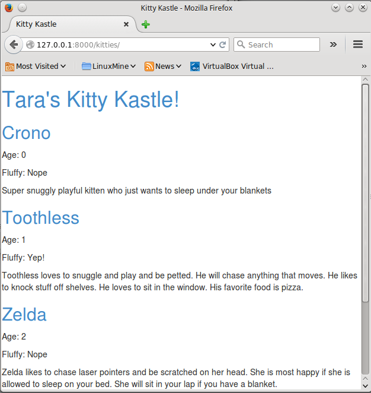
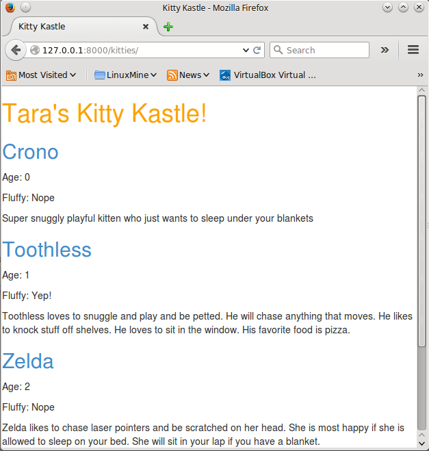
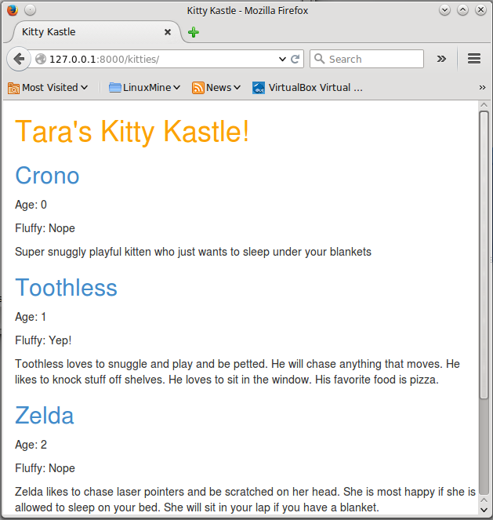
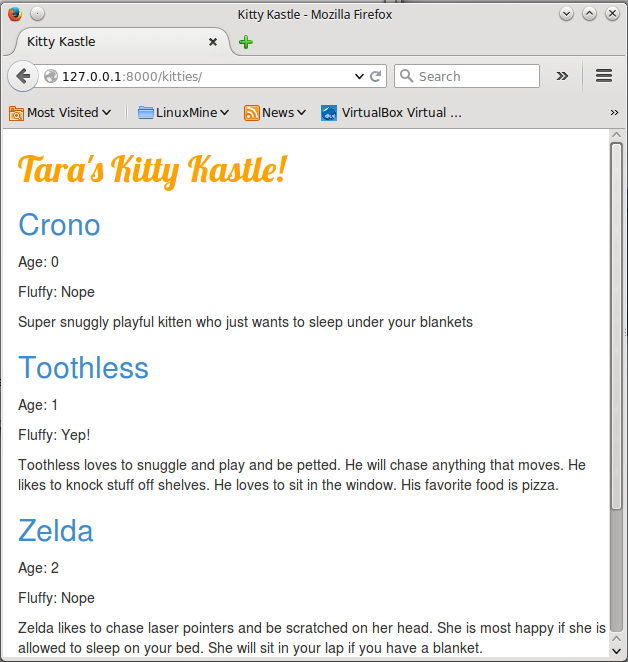
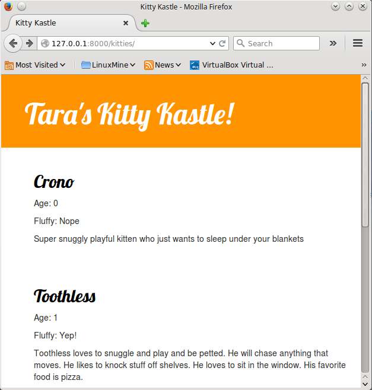

# Appendix B: CSS #

## What is it ? ##

Cascading Style Sheets (CSS) is a language used for describing the look and formatting of a website written in markup language (like HTML).

But we don't want to start from scratch again, right? We will, once more, use something that has already been done by programmers and released on the Internet for free. You know, reinventing the wheel is no fun.

## Let's use Bootstrap! ##

Bootstrap is one of the most popular HTML and CSS frameworks for developing beautiful websites: http://getbootstrap.com/

It was written by programmers who worked for Twitter and is now developed by volunteers from all over the world.

## Link to Bootstrap ##

To use Bootstrap, you need to add this to your `<head>` in your `.html` file (`cat_shelter/templates/blog/current_cats.html`):

```
    <link rel="stylesheet" href="//maxcdn.bootstrapcdn.com/bootstrap/3.2.0/css/bootstrap.min.css">
    <link rel="stylesheet" href="//maxcdn.bootstrapcdn.com/bootstrap/3.2.0/css/bootstrap-theme.min.css">
```

This doesn't add any files to your project. It just points to files that exist on the internet.
Just go ahead, open your website and refresh the page. Here it is!



Looking nicer already!

## Static files in Django ##

There are two kinds of files in Django -- __static__ and __dynamic__.  You've already met dynamic files -- your templates were dynamic, as their content could change based on content or context.  Files which don't do that - which are the same no matter what - are called __static files__.  So, all your CSS and images are static files -- they will be the same for every user, every time.

CSS is a static file, so in order to leverage CSS, we need to first configure static files in Django. You'll only need to do it once. Let's start:

### Configure static files in Django ###

First, we need a directory to store our static files. Go ahead and create the `workspace/static` directory.

    workspace
    ├─── static
    └─── manage.py

Open up the `critter_site/settings.py` file, scroll to the bottom of it and add the following lines:

```
STATICFILES_DIRS = (
    os.path.join(BASE_DIR, "static"),
)
```

This tells Django where to look for your static files.

## Your first CSS file! ##

Let's create a CSS file now, to add your own style to your web-page. Create a new directory called `css` inside your `static` directory. Then create a new file called `cat_shelter.css` inside this `css` directory. Ready?

    static
    └─── css
            cat_shelter.css

Time to write some CSS! Open up the `static/css/cat_shelter.css` file in your code editor.

We won't be going too deep into customizing and learning about CSS, because the concepts are comparatively simple and you can learn it on your own after this workshop. We really recommend doing this [Codeacademy HTML & CSS course](http://www.codecademy.com/tracks/web) to learn everything you need to know about making your websites more pretty with CSS.

But let's do at least a little. Maybe we could change the color of our header? To understand colors, computers use special codes. They start with `#` and are followed by 6 letters (A-F) and numbers (0-9). You can find example color codes here: http://www.colorpicker.com/. You may also use [predefined colors](http://www.w3schools.com/cssref/css_colornames.asp), such as `red` and `green`.

In your `static/css/cat_shelter.css` file you should add the following code:

```css
    h1 a {
        color: #FCA205;
    }
```

`h1 a` is a CSS Selector. Selectors match elements in your HTML and then apply to them the formatting instructions you specify.  The example above says to make `#FCA205` (orange) all `a` elements inside of an `h1` element (i.e. when we have HTML like: `<h1><a href="">link</a></h1>`).  Of course, you can choose your own color instead!

In a CSS file we determine styles for HTML elements. Elements are identified by name (i.e. `a`, `h1`, `body`), attribute `class`, or attribute `id`. Class and id are names you give the element by yourself. Classes define groups of elements, and ids point to specific elements. For example, the following HTML tag may be identified by CSS using the tag name `a`, the class `external_link`, or the id `link_to_wiki_page`:

```html
    <a href="http://en.wikipedia.org/wiki/Django" class="external_link" id="link_to_wiki_page">
```

Read about [CSS Selectors in w3schools](http://www.w3schools.com/cssref/css_selectors.asp).

Then, we need to also tell our HTML template that we added some CSS. Open the `cat_shelter/templates/cat_shelter/current_cats.html` file and add this line at the very beginning of it:

``

(Remember the `` wrapper tells Django to interpret the statements inside - which say to load static files here. :) )

Then, between the `<head>` and `</head>`, after the links to the Bootstrap CSS files add: 

```html
<link rel="stylesheet" href="">
```

(Note: The browser reads the files in the order they're given, so we want to load our file after Bootstrap so we can  override parts of it.)
 
And now our template will include our CSS file!  Your file should now look like this:

```html

<html>
	<head>
	<title>Kitty Kastle</title>
	<link rel="stylesheet" href="//maxcdn.bootstrapcdn.com/bootstrap/3.2.0/css/bootstrap.min.css"> <link rel="stylesheet" href="//maxcdn.bootstrapcdn.com/bootstrap/3.2.0/css/bootstrap-theme.min.css">
	<link rel="stylesheet" href="">
	</head>
	<body>
	<div>
	  <h1><a href="">Tara's Kitty Kastle!</a></h1>
	</div>
	
	
	  <div>
	    <h2><a href=""> {{ cat.name }}</a></h2>
	    <p>Age: {{ cat.age }}</p>
	    <p>Fluffy: 
	    
	      Yep! 
	    
	      Nope
	    </p>
	    <p>{{ cat.desc|linebreaks}}</p>
	  </div>
	
	
	</body>
</html>
```

Save your file and refresh the site!



**NOTE** The names aren't colorized.  Hmm.  That's probably because they're header type `h2` instead of `h1`.  Change the CSS to select `h1 a, h2 a` instead of just `h1 a` so our styling is applied to both.

Nice work! It's a bit cramped, though -- let's give our website a little air by increasing the left margin.

```css
    body {
        padding-left: 15px;
    }
```

Add that to your CSS, save the file and see how it looks!



Maybe we can customize the font in our header? Paste this into your `<head>` in `cat_shelter/templates/cat_shelter/current_cats.html` file:

```html
    <link href="http://fonts.googleapis.com/css?family=Lobster&subset=latin,latin-ext" rel="stylesheet" type="text/css">
```

This line will import a font called *Lobster* from Google Fonts (https://www.google.com/fonts).

Now open up your CSS file `static/css/cat_shelter.css`.   Inside the `h1 a` block (between the braces `{` and `}`), add `font-family: 'Lobster';`, thusly:

```css
    h1 a {
        color: #FCA205;
        font-family: 'Lobster';
    }
```

Save and refresh the page--



Great!


As mentioned above, CSS has a concept of classes.  CSS classes allow you to name part of the HTML and style only the parts you name. It's super helpful if you have two divs doing different things-- (like a header and a sidebar)-- you don't always want them to look the same.

Go ahead and name some parts of your HTML code. Add a class called `page-header` to the `div` containing your header, like this:

```html
    <div class="page-header">
        <h1><a href="/">Tara's Kitty Kastle!</a></h1>
    </div>
```

And add a `cat` class to your cat-description `div` : 

```html
      <div class="cat">
        <h2><a href=""> {{ cat.name }}</a></h2>
        <p>Age: {{ cat.age }}</p>
        <p>Fluffy:
        
          Yep!
        
          Nope
        </p>
        <p>{{ cat.desc|linebreaks}}</p>
      </div>

```

Now we can add declaration blocks to style our selectors. Selectors starting with `.` relate to classes.  There are many great tutorials and explanations about CSS on the Web to help you understand the following code. For now, just copy and paste it into your `workspace/static/css/cat_shelter.css` file:

```css
    .page-header {
        background-color: #ff9400;
        margin-top: 0;
        padding: 20px 20px 20px 40px;
    }

    .page-header h1, .page-header h1 a, .page-header h1 a:visited, .page-header h1 a:active {
        color: #ffffff;
        font-size: 36pt;
        text-decoration: none;
    }

    .content {
        margin-left: 40px;
    }

    h1, h2, h3, h4 {
        font-family: 'Lobster', cursive;
    }

    .date {
        float: right;
        color: #828282;
    }

    .save {
        float: right;
    }

    .post-form textarea, .post-form input {
        width: 100%;
    }

    .top-menu, .top-menu:hover, .top-menu:visited {
        color: #ffffff;
        float: right;
        font-size: 26pt;
        margin-right: 20px;
    }

    .cat {
        margin-bottom: 70px;
    }

    .cat h2 a, .post h2 a:visited {
        color: #000000;
    }
```

Then add divs with classes to the HTML code which displays the cats. Replace this:

```html
    
      <div class="cat">
        <h2><a href=""> {{ cat.name }}</a></h2>
        <p>Age: {{ cat.age }}</p>
        <p>Fluffy:
        
          Yep!
        
          Nope
        </p>
        <p>{{ cat.desc|linebreaks}}</p>
      </div>
    
```

in the `cat_shelter/templates/cat_shelter/current_cats.html` with this:

```html
    <div class="content container">
        <div class="row">
            <div class="col-md-8">
                
                  <div class="cat">
                    <h2><a href=""> {{ cat.name }}</a></h2>
                    <p>Age: {{ cat.age }}</p>
                    <p>Fluffy:
                   
                     Yep!
                   
                     Nope
                   </p>
                   <p>{{ cat.desc|linebreaks}}</p>
                </div>
              
          </div>
      </div>
  </div>
```

Save those files and refresh your website.



Woohoo! Looks awesome, right? Don't be afraid to tinker with the CSS.  Try to change some things!  If you break something, don't worry--you can always undo it.

Anyway, we really recommend taking this free online [Codeacademy HTML & CSS course](http://www.codecademy.com/tracks/web) as some post-workshop homework to learn everything you need to know about making your websites prettier with CSS.

Ready for the next chapter?! :)