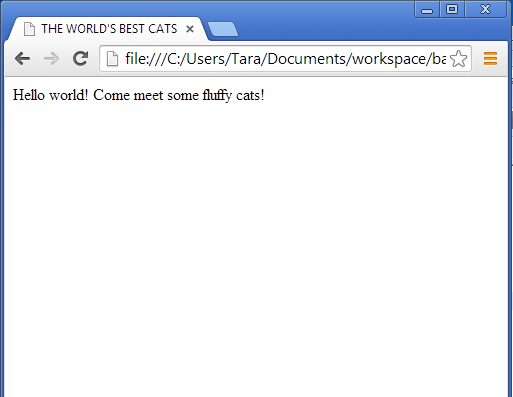
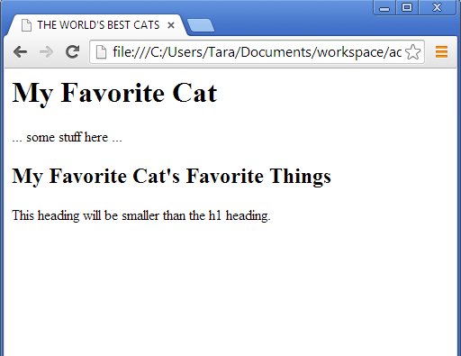
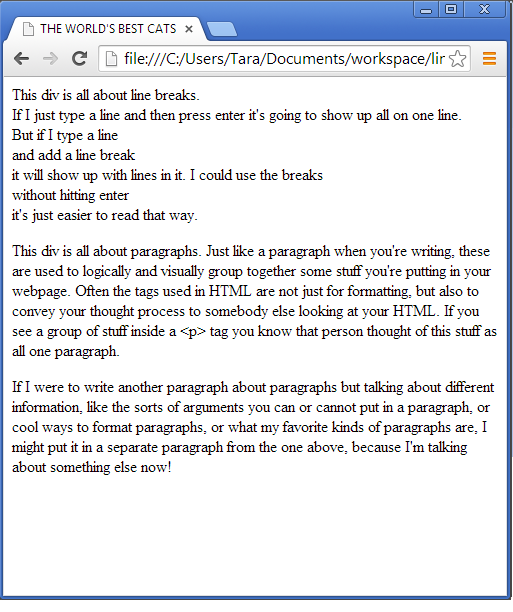
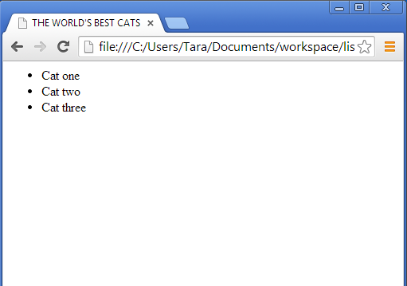
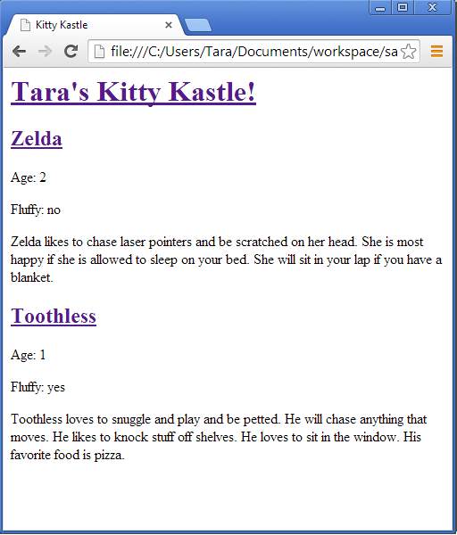

# Introduction to HTML #

## What is it? ##
- Acronym for Hyper-Text Markup Language
- The most basic language for describing a web page
- Your views (web pages) will be written in HTML!

## Notes ##
- HTML file names usually end in `.html`
- HTML marks up text by wrapping parts of the text in tags. Tags are instructions.
- Tags are balanced (they have an opening and a corresponding closing tag, which must match).  Tags can be nested.  Like parentheses:
```<lunch><sandwich>PB&J</sandwich><lunch>```
- There are a ton of different formatting options to change how your web pages look.  We're only going to talk about the basics, but you can get more information from the internet!


- Basic layout of html page
  - HTML pages always start and end with an HTML tag
    - `<html> YOUR STUFF HERE </html>`
  - The head tag goes at the beginning and contains the title and other settings for the rest of the file
    - `<head> <title>My First Webpage!</title> </head>`
  - The body is the bulk of your web page: everything you wanna display and the formatting for those things.
     - `<body> This is my very first webpage!  Hello world! </body>`

*Example*

    <html>
      <head>
        <title>THE WORLD'S BEST CATS</title>
      <head>
      <body>
        Hello world!  Come meet some fluffy cats!
      </body>
    </html>
	


- Adding a heading
  - Headings indicate hierarchy.  Smaller numbers for bigger sections.
  - Use the heading tags for headers and subheaders
    - `<h1></h1>`, `<h2></h2>`, `<h3></h3>` etc

*Example*

    <html>
      <head>
        <title>THE WORLD'S BEST CATS</title>
      </head>
      <body>
        <h1>My Favorite Cat</h1>
        ... some stuff here ...
        <h2>My Favorite Cat's Favorite Things</h2>
        This heading will be smaller than the h1 heading.
      </body>
    </html>
	


- Line breaks, paragraphs, and divs
  - Line breaks and paragraphs allow you to break up large blocks of text.
  - A line break `<br></br>` can be shortened to `<br />` and just indicates a new line.
    - Hitting enter in the middle of typing words in a webpage won't (usually) work.  The browser will smoosh it all together when rendering.  You have to use a `<br />` to indicate that you really want a newline there.
  - Paragraphs `<p></p>` logically group text together.  It says "All this text goes together, and the text outside it goes to something else."
  - Divs `<div></div>` let you group together more complex things.  Where paragraphs group a few sentences, a div might group a few paragraphs, like a chapter if the whole page is your book.  Or, it could group together some text, a button, and an image if they all go together as a unit.

*Example*

    <html>
      <head>
        <title>THE WORLD'S BEST CATS</title>
      </head>
      <body>
        <div>
          This div is all about line breaks.<br />
          If I just type a line
          and then press enter
          it's going to show up all on one line.
        <br />
          But if I type a line<br />
          and add a line break<br />
          it will show up with lines in it.
          I could use the breaks<br />without hitting enter<br />it's just easier to read that way.
        </div>
        <div>
          <p>
            This div is all about paragraphs.  Just like a paragraph when you're writing, these are used to logically and visually group together some stuff you're putting in your webpage.  Often the tags used in HTML are not just for formatting, but also to convey your thought process to somebody else looking at your HTML.  If you see a group of stuff inside a <p> tag you know that person thought of this stuff as all one paragraph.
          </p>
            If I were to write another paragraph about paragraphs but talking about different information, like the sorts of arguments you can or cannot put in a paragraph, or cool ways to format paragraphs, or what my favorite kinds of paragraphs are, I might put it in a separate paragraph from the one above, because I'm talking about something else now!
          </p>
        </div>
      </body>
    </html>
  
  

- Links
  - `<a href="URL TO LINK TO">Text displayed for your link!</a>`
  - Just like you can put header tags inside divs or paragraphs, you can put links inside header tags or other formatting tags.
    - `<h1><a href="www.google.com">Google!</a></h1>`
    - If you leave the url blank it will create what looks like a link, but clicking it won't go anywhere
      - `<a href="">This link won't go anywhere</a>`

- Lists
  - `<ul></ul>` : indicate the beginning and end of a list
  - `<li></li>` : indicate the beginning and end of a list entry
  - Just like for everything else in HTML, the newlines and indentation are optional--they just make it easier to read.

*Example*

    <html>
      <head>
        <title>THE WORLD'S BEST CATS</title>
      </head>
      <body>
        <ul>
          <li>Cat one</li>
          <li>Cat two</li>
          <li>Cat three</li>
        </ul>
      </body>
    </html>
	


## Next Steps ##

### Build your views ###
(such as `cat_shelter/templates/cat_shelter/current_cats.html`)

Why: So you have something to display when your app gets asked for a page!

How:
  - Wrap the whole page in `<html></html>` tags
  - Create a head with a title for your page
  - Create a body with headings, paragraphs, line breaks, divs, lists, links, or whatever!

*Example*

    <html>
      <head>
        <title>Kitty Kastle</title>
      </head>
      <body>
        <div>
          <h1><a href="">Tara's Kitty Kastle!</a></h1>
        </div>
        <div>
          <h2><a href="">Zelda</a></h2>
          <p>Age: 2</p>
          <p>Fluffy: no</p>
          <p>Zelda likes to chase laser pointers and be scratched on her head.  She is most happy if she is allowed to sleep on your bed.  She will sit in your lap if you have a blanket.</p>
        </div>
        <div>
          <h2><a href="">Toothless</a></h2>
          <p>Age: 1</p>
          <p>Fluffy: yes</p>
          <p>Toothless loves to snuggle and play and be petted.  He will chase anything that moves.  He likes to knock stuff off shelves.  He loves to sit in the window.  His favorite food is pizza.</p>
        </div>
      </body>
    </html>

